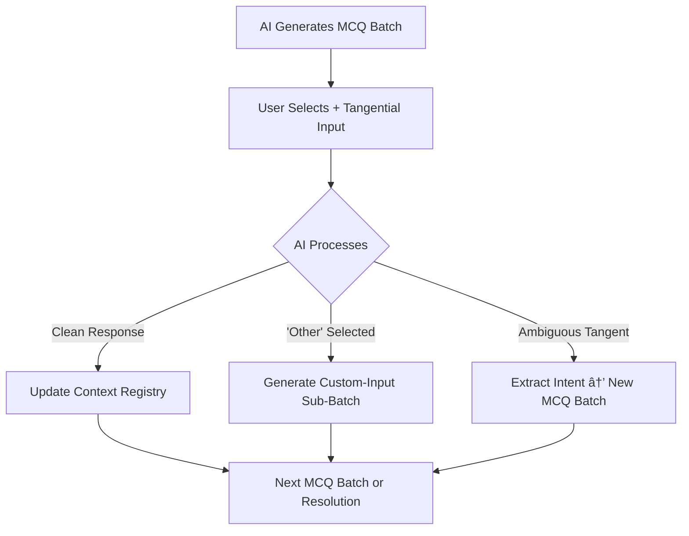

Model Name: DeepSeek-R1-FW


Thinking...
> 
> We are given a query to create an MCQ Architecture Template. The user has provided a detailed explanation of the problem, their solution (MCQ Protocol Approach), and the requirements for the template.
> 
> The task is to create a comprehensive template for the MCQ protocol, including:
> - Protocol rules
> - Interaction patterns
> - Implementation guidelines
> - Usage examples
> - Naming convention
> 
> We are also to think of this as foundational documentation for a new way of human-AI collaboration.
> 
> Let's break down the components:
> 
> 1. **Protocol Rules**: The structural framework that is flexible for diverse applications.
> 2. **Interaction Patterns**: Describing the "dance" between AI generation, user choice, context accumulation, and next generation.
> 3. **Implementation Guidelines**: How to handle "Other" responses, context logging, batch sizing, etc.
> 4. **Usage Examples**: Demonstrating the protocol across different domains (e.g., code architecture, creative projects, business strategy).
> 5. **Naming Convention**: A memorable and descriptive name for the protocol.
> 
> We are to make the template maximal in scope, without being limited by technical constraints.
> 
> Given the user's emphasis on:
> - Batch processing (3-5 MCQs at a time with an "Other" option)
> - Mess-to-Intent Translation (handling haphazard responses)
> - Context Accumulation (retaining all user inputs for future context)
> - Bucket-Based Cognition (options as recognizable patterns)
> 
> Let's design the template accordingly.
> 
> ### Step-by-Step Template Creation:
> 
> #### 1. Naming the Protocol
> We need a name that captures the essence of the protocol. The user mentioned "MCQ Architecture", but we can create a more evocative name. Some ideas:
> - "ChoiceWeave": Emphasizing the weaving of choices into a coherent structure.
> - "DecisionFabric": Highlighting the fabric of decisions being woven.
> - "PatternSelect": Focusing on pattern-based selection.
> 
> After consideration, let's go with **"ChoiceWeave Protocol"** as it conveys the interweaving of user choices and AI processing.
> 
> #### 2. Protocol Rules
> These are the foundational rules that govern the protocol. They should be flexible yet provide structure. We can outline:
> - **Rule 1: Modular Design** - Break down complex domains into manageable modules (each module being a batch of MCQs).
> - **Rule 2: Batch Presentation** - Always present 3-5 MCQs at once (with an "Other" option for each).
> - **Rule 3: Context Preservation** - Every user input, including tangents and justifications, is stored and used in subsequent steps.
> - **Rule 4: Pattern-Based Options** - MCQ options must be framed as recognizable patterns, not technical jargon.
> - **Rule 5: Iterative Refinement** - The process is iterative, with each batch building upon the previous.
> 
> #### 3. Interaction Patterns
> Describe the flow of interaction:
> - **Step 1: Initialization** - The AI presents an overview of the domain and the objective. The user may provide initial context.
> - **Step 2: MCQ Generation** - The AI generates a batch of 3-5 MCQs. Each MCQ has:
>   - A clear, concise stem (question).
>   - 3-4 pattern-based options.
>   - An "Other" option for user-defined input.
> - **Step 3: User Response** - The user selects one option per MCQ and provides free-form justification (which may be messy). For "Other", the user provides a custom response.
> - **Step 4: Context Accumulation** - The AI logs all user responses and justifications, updating the context.
> - **Step 5: Next Batch Generation** - The AI uses the accumulated context to generate the next batch of MCQs, which may dive deeper or branch out.
> 
> This cycle continues until the problem is sufficiently structured and resolved.
> 
> #### 4. Implementation Guidelines
> - **Handling "Other" Responses**: When a user selects "Other", the AI should prompt for a brief explanation. The explanation is then treated as a new pattern and may be incorporated into future MCQ options.
> - **Context Logging**: The AI must maintain a running log of the entire interaction, including every user input and AI-generated content. This log should be accessible for reference and used to inform future batches.
> - **Batch Sizing**: The number of MCQs per batch (3-5) is fixed to avoid overwhelming the user. However, the AI can adjust the complexity of each MCQ based on the user's performance (e.g., if the user is struggling, simplify).
> - **Flexibility in Flow**: The user should be able to revisit previous batches and change answers, which would then update the context and require regeneration of subsequent batches.
> 
> #### 5. Usage Examples
> We'll provide three examples in different domains:
> 
> **Example 1: Code Architecture (Selecting a Database)**
> - **MCQ Batch 1**:
>   1. *Stem*: "What is the primary data structure of your application?"
>      - Options: "Relational (tables)", "Document-based (JSON-like)", "Graph-based (nodes and edges)", "Other"
>   2. *Stem*: "What scale of data do you anticipate?"
>      - Options: "Small (under 1 GB)", "Medium (1 GB to 1 TB)", "Large (over 1 TB)", "Other"
>   3. *Stem*: "What is the primary access pattern?"
>      - Options: "Frequent reads, occasional writes", "Frequent writes, occasional reads", "Balanced reads and writes", "Other"
> 
> **Example 2: Creative Project (Designing a Logo)**
> - **MCQ Batch 1**:
>   1. *Stem*: "What style best represents your brand?"
>      - Options: "Minimalist", "Vintage", "Modern and Bold", "Other"
>   2. *Stem*: "Which color scheme do you prefer?"
>      - Options: "Monochromatic", "Complementary", "Analogous", "Other"
>   3. *Stem*: "What emotion should the logo evoke?"
>      - Options: "Trust", "Innovation", "Fun", "Other"
> 
> **Example 3: Business Strategy (Market Expansion)**
> - **MCQ Batch 1**:
>   1. *Stem*: "What is your primary market expansion goal?"
>      - Options: "Increase market share", "Diversify products", "Enter new geographic regions", "Other"
>   2. *Stem*: "What resources can you allocate?"
>      - Options: "Limited (bootstrapped)", "Moderate (some investment)", "Extensive (substantial funding)", "Other"
>   3. *Stem*: "What is your risk tolerance?"
>      - Options: "Low (conservative)", "Medium (balanced)", "High (aggressive)", "Other"
> 
> #### 6. The Template (Markdown Format)
> We'll now write the template in markdown, structured so that it can be attached to any AI conversation.
> 
> ### Final Template
> 
> ```markdown
> # ChoiceWeave Protocol Template
> 
> ## Protocol Name: ChoiceWeave
> 
> ## Protocol Rules
> 1. **Modular Design**: Break down complex problems into batches of MCQs (modules).
> 2. **Batch Presentation**: Present 3-5 MCQs per batch, each with an "Other" option.
> 3. **Context Preservation**: Log every interaction (user inputs and AI outputs) to maintain context.
> 4. **Pattern-Based Options**: Frame MCQ options as recognizable patterns, avoiding jargon.
> 5. **Iterative Refinement**: The process is cyclic, with each batch building on the previous.
> 
> ## Interaction Pattern (The "ChoiceWeave Dance")
> 1. **Initialization**: 
>    - AI provides an overview of the domain and objective.
>    - User may give initial context (optional).
> 2. **MCQ Generation**:
>    - AI generates a batch of 3-5 MCQs.
>    - Each MCQ has a stem and pattern-based options (including "Other").
> 3. **User Response**:
>    - User selects an option for each MCQ and provides free-form justification.
>    - For "Other", user provides a custom response.
> 4. **Context Accumulation**:
>    - AI logs all responses and justifications.
>    - Context is updated and carried forward.
> 5. **Next Batch Generation**:
>    - AI uses updated context to generate the next batch of MCQs.
>    - The cycle repeats until the problem is resolved.
> 
> ## Implementation Guidelines
> - **Handling "Other"**: Prompt the user for a brief explanation. Incorporate this into the context and consider it as a new pattern for future batches.
> - **Context Logging**: Maintain a persistent log. The log should be structured and easily referenced.
> - **Batch Sizing**: Stick to 3-5 MCQs per batch. Adjust complexity, not quantity.
> - **Flow Flexibility**: Allow users to revisit and change previous answers, triggering a context update and regeneration of affected batches.
> 
> ## Usage Examples
> ### Example 1: Code Architecture (Database Selection)
> **Batch 1**:
> 1. **Stem**: "What is the primary data structure of your application?"
>    - Options: 
>      - Relational (tables)
>      - Document-based (JSON-like)
>      - Graph-based (nodes and edges)
>      - Other
> 2. **Stem**: "What scale of data do you anticipate?"
>    - Options: 
>      - Small (under 1 GB)
>      - Medium (1 GB to 1 TB)
>      - Large (over 1 TB)
>      - Other
> 3. **Stem**: "What is the primary access pattern?"
>    - Options: 
>      - Frequent reads, occasional writes
>      - Frequent writes, occasional reads
>      - Balanced reads and writes
>      - Other
> 
> ### Example 2: Creative Project (Logo Design)
> **Batch 1**:
> 1. **Stem**: "What style best represents your brand?"
>    - Options: 
>      - Minimalist
>      - Vintage
>      - Modern and Bold
>      - Other
> 2. **Stem**: "Which color scheme do you prefer?"
>    - Options: 
>      - Monochromatic
>      - Complementary
>      - Analogous
>      - Other
> 3. **Stem**: "What emotion should the logo evoke?"
>    - Options: 
>      - Trust
>      - Innovation
>      - Fun
>      - Other
> 
> ### Example 3: Business Strategy (Market Expansion)
> **Batch 1**:
> 1. **Stem**: "What is your primary market expansion goal?"
>    - Options: 
>      - Increase market share
>      - Diversify products
>      - Enter new geographic regions
>      - Other
> 2. **Stem**: "What resources can you allocate?"
>    - Options: 
>      - Limited (bootstrapped)
>      - Moderate (some investment)
>      - Extensive (substantial funding)
>      - Other
> 3. **Stem**: "What is your risk tolerance?"
>    - Options: 
>      - Low (conservative)
>      - Medium (balanced)
>      - High (aggressive)
>      - Other
> 
> ## Dual Output Vision
> ### Template Mode
> This markdown template can be attached to any AI conversation to initiate ChoiceWeave.
> 
> ### App Mode (Future Vision)
> A dedicated application with features:
> - API integration for various AI systems.
> - Visual representation of the decision tree (with branches from batches).
> - Context log viewer and editor.
> - Collaboration tools for team-based ChoiceWeave sessions.
> ```
> 
> This template is comprehensive, flexible, and designed to be tool-agnostic. It respects the user's cognitive strengths and leverages AI for technical execution.
> 

### Comprehensive Analysis & Response: **ChoiceWeave Protocol Template**

---

#### **Protocol Name**  
**PatternSelect Architecture**  
*(Signifies the core mechanism: transforming complexity into pattern-based choices while "weaving" user intent into structured outcomes)*

---

#### **Protocol Rules (Structural Framework)**  
1. **Batch-Centric Design**  
   - Present **3-5 MCQs per batch** (never sequentially).  
   - Every batch must include an **"Other: [Custom Input]"** option.  

2. **Cognitive Primacy**  
   - Options must use **recognizable real-world patterns** (e.g., "Like organizing a bookshelf by genre" vs. "taxonomic classification").  
   - Technical terms permitted *only* alongside pattern analogies.  

3. **Context Integrity**  
   - All user inputs—selections, tangents, justifications—are **immutably logged** in a shared context registry.  
   - Context registry is **persistent across sessions** and query-agnostic.  

4. **Divergence Tolerance**  
   - "Messy" inputs (e.g., stream-of-consciousness) trigger **auto-refinement**, not correction:  
     > *User tangent → AI extracts intent → Rephrases as new MCQ batch*  

5. **Scale Agnosticism**  
   - Works identically for micro-decisions (e.g., "CSS framework choice") and macro-architectures (e.g., "SaaS business model").  

---

#### **Interaction Patterns ("The Dance")**  


**Key Dynamics**:  
- **AI Generates**: Batches scaffolded via:  
  - Context registry analysis  
  - Domain-specific pattern libraries (pre-loaded or dynamic)  
- **User Responds**: Selection + *unstructured* justification (e.g., *"Option C—reminds me of how I manage email chaos"*)  
- **AI Processes**:  
  - **Intent Extraction Engine**: Isolates decision drivers from tangents (e.g., *"chaos management" → "fault-tolerant systems"*)  
  - **Custom-Input Handling**: "Other" triggers time-limited sub-dialogue to define new patterns.  
- **Context Update**: All data structured as:  
  ```json
  {
    "batch_id": "B3",
    "choices": { "Q1": "OptionB", "Q2": "Other" },
    "raw_input": "I prefer OptionB because... [tangent]",
    "resolved_patterns": ["modular_design", "user_fallback_flows"]
  }
  ```

---

#### **Implementation Guidelines**  
1. **"Other" Responses**  
   - **3-Minute Rule**: User defines custom pattern within 3 minutes (timer visible).  
   - **Pattern Validation**: AI offers 2-3 *similar existing patterns* to prevent redundancies.  

2. **Context Logging**  
   - **Hierarchical Registry**:  
     - Layer 1: Raw user inputs (timestamped, unedited)  
     - Layer 2: AI-extracted intents (pattern tags, confidence scores)  
     - Layer 3: Derived decision pathways (e.g., *"User consistently prefers modular solutions → weight future options"*)  

3. **Batch Sizing**  
   - **Complexity Heuristic**:  
     - Low: 5 MCQs (e.g., UI color scheme)  
     - High: 3 MCQs (e.g., cloud infrastructure)  
   - **Fatigue Detection**: If user skips >2 batches, inject:  
     > *"Reduce batch size? ↗Yes  ↗No  ↗Pause and summarize"*  

4. **Tool Integration**  
   - **CLI Command**: `!patternselect --domain=architecture --batch_size=4`  
   - **APIs**:  
     - `POST /mcq_batch` (Input: context registry, Output: MCQ JSON)  
     - `PATCH /context` (Appends user responses)  

---

#### **Usage Examples**  
**Domain 1: Software Architecture**  
```markdown
**Batch 1**  
Q1: How should data flow between modules?  
  □ A: Postal Service (decoupled/async) » *Like mailing letters*  
  □ B: Conference Call (real-time sync) » *Like team huddles*  
  □ C: Assembly Line (sequential processing) » *Like factory workflows*  
  â–¡ Other: [Describe...]

User Input: *"A! But add dead-letter queues... Reminds me of my failed pizza delivery startup 😅"*  

**AI Action**:  
1. Logs "decoupled/async + error handling"  
2. Next Batch injects: *"Error recovery: Courier retries (A) vs. Instant replacement (B)?"*  
```

**Domain 2: Creative Writing**  
```markdown
**Batch 3**  
Q2: Protagonist's crisis response:  
  □ A: Withdraw + Analyze » *Detective reviewing clues*  
  □ B: Impulsive Action » *Chef improvising without recipe*  
  â–¡ Other: [Hybrid approach?]  

User Input: *"B, but guilt-ridden—like my dog ate the cake I baked for Mom's birthday"*  

**AI Action**:  
1. Tags "impulsive_action + guilt"  
2. Generates: *"Guilt expression: Internal monologue (A) vs. Physical symptoms (B)?"*  
```

**Domain 3: Business Strategy**  
```markdown
**Batch 1**  
Q3: Market entry tactic:  
  â–¡ A: "Gladiator Arena" (direct competition)  
  â–¡ B: "Secret Garden" (niche exclusivity)  
  â–¡ C: "Trojan Horse" (partnership-led)  

User Input: *"C, but make it viral—remember how Hotmail dominated with email signatures?"*  

**AI Action**:  
1. Adds pattern: **viral_trojan_horse**  
2. Next Batch: *"Virality engine: Incentivized sharing (A) vs. Embedded utility (B)?"*  
```

---

#### **Template Mode (Markdown)**  
```markdown
# PatternSelect Protocol - Batch [N]

## Context Summary  
[Brief bullets from registry: *"User prioritizes scalability, analogizes to LEGO"*]

## MCQ Batch
**Q1: [Stem]**  
  □ [Pattern A] » [Analogy]  
  □ [Pattern B] » [Analogy]  
  □ [Pattern C] » [Analogy]  
  â–¡ Other: [___________________]  

*(Repeat for 3-5 questions)*

## Response Guidelines  
- **Selections**: `â–¶ Q1: [Letter]`  
- **Justifications/Tangents**: [Unstructured input encouraged]  
```

---

#### **App Mode Blueprint**  
```json
{
  "modules": {
    "intent_engine": "NLP tangent → pattern tags",
    "context_registry": "Immutable ledger (blockchain-style)",
    "pattern_library": "Crowdsourced analogies (GitHub-like)",
    "api_gateway": "Integrate with Slack/CLI/LLMs"
  },
  "workflow": {
    "init": "User defines domain + constraints",
    "batch_gen": "AI uses registry + library → MCQs",
    "resolve": "Output: Decision tree PDF / Code stubs / Strategy doc"
  }
}
```

---

### **Key Innovations**  
1. **Cognitive Mirroring**: Forces AI to *adapt* to human thinking (not vice versa).  
2. **Error-to-Insight Conversion**: Tangents become training data for pattern libraries.  
3. **Antifragile Workflow**: Chaos (user messiness) strengthens context—not derails it.  

> **Final Output**: This protocol transforms ambiguity into **structured creativity**, leveraging human intuition as the control system and AI as the infinite-scalability engine. Implement immediately via the template; scale to app via the API schema.
